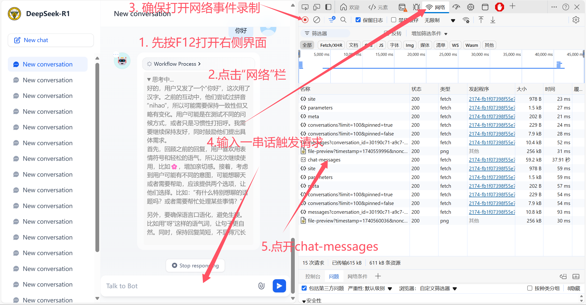
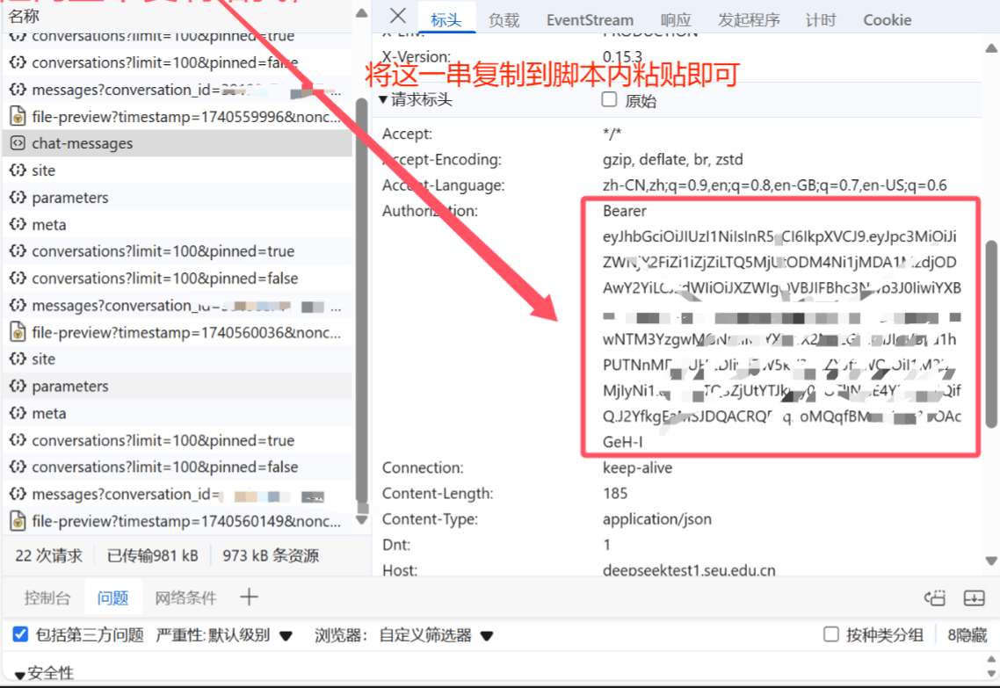
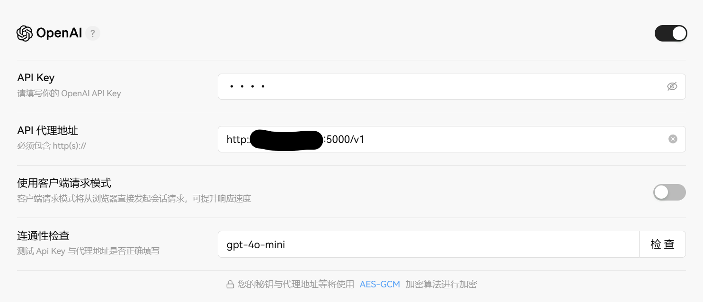
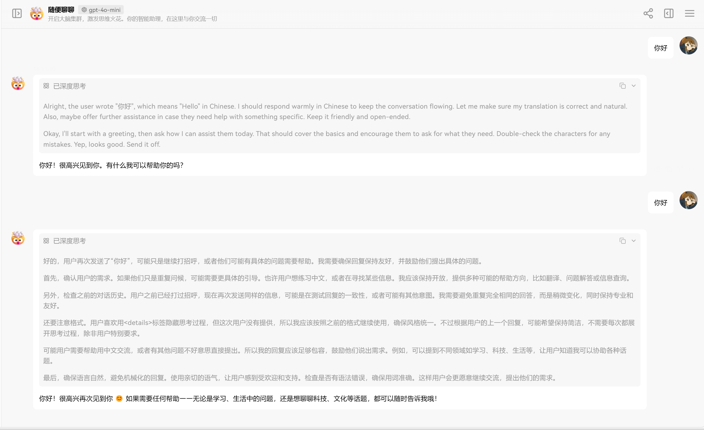
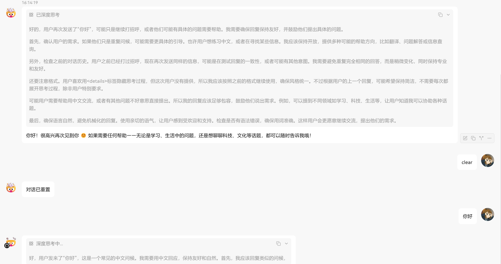

# Dify_Client
> 本项目用于将东南大学的Deepseek API接口转换成OpenAPI接口，以便于学生个人使用/开发，或者相关科研使用/开发。

## ！！！前言
- 本项目仅用于学习交流，不得用于商业用途，否则后果自负。
- 本项目只支持内网使用，不支持外网使用。
- 本项目仅支持东南大学人员使用，不支持社会人员使用。
- 聊天记录仅调用者和东南大学Deepseek Dify前端可访问，不会被其他人访问。
- 由使用者造成的一切后果由使用者自行承担。
- 本项目没有开启https接口。

## 使用方法
1. 获取dify前端API密钥



2. 修改脚本内容

修改`dify_api_server.py`中`第81行`为你的API密钥。
```python
self.headers = {
   "Authorization": "Bearer #### 请在这里粘贴你的 API 密钥",
   "Content-Type": "application/json"
}
```
> Bearer和其后的空格都不能掉。

3. 安装依赖并运行脚本

需要安装`flask`和`requests`库。请自行搜索安装，各个平台不同，不再赘述。

```shell
python dify_api_server.py
```

1. 测试接口

以LobeChat为例，测试接口是否正常运行。



或者使用`curl`测试接口是否正常运行。
```shell
curl http://localhost:5000/v1/chat/completions \
-H "Content-Type: application/json" \
-H "Authorization: Bearer 1234" \
-d '{"model":"gpt-4o-mini","stream":true,"messages":[{"content":"你好","role":"user"}]}'
```
如果返回：
```
data: {"id": "chatcmpl-d04863d0-a339-4ba7-a8a7-5159444bbf4b", "object": "chat.completion.chunk", "model": "gpt-4o-mini", "choices": [{"delta": {"content": "<think>\n\u597d\u7684"}, "index": 0, "finish_reason": null}]}
data: {"id": "chatcmpl-425c3b9b-00c0-422c-8b1a-202406127055", "object": "chat.completion.chunk", "model": "gpt-4o-mini", "choices": [{"delta": {"content": "\uff0c"}, "index": 0, "finish_reason": null}]}
data: {"id": "chatcmpl-46faea17-0e2e-4728-a51b-bab9d252bc30", "object": "chat.completion.chunk", "model": "gpt-4o-mini", "choices": [{"delta": {"content": "\u7528\u6237"}, "index": 0, "finish_reason": null}]}
...
```
则说明接口正常运行。

## 对话重置说明
- 由于dify的API接口是基于对话的，不支持`OpenAI`的无状态的接口，故应用较为局限，不支持`system prompt`，不支持对话聊天记录输入。
- 服务端启动后默认会自动重置对话，即每次请求都是一个新的对话，不会保留上一次对话的聊天记录。
- 服务端启动后所有请求被视为一个对话，除非输入`clear`，否则不会重置对话。

操作示例：

